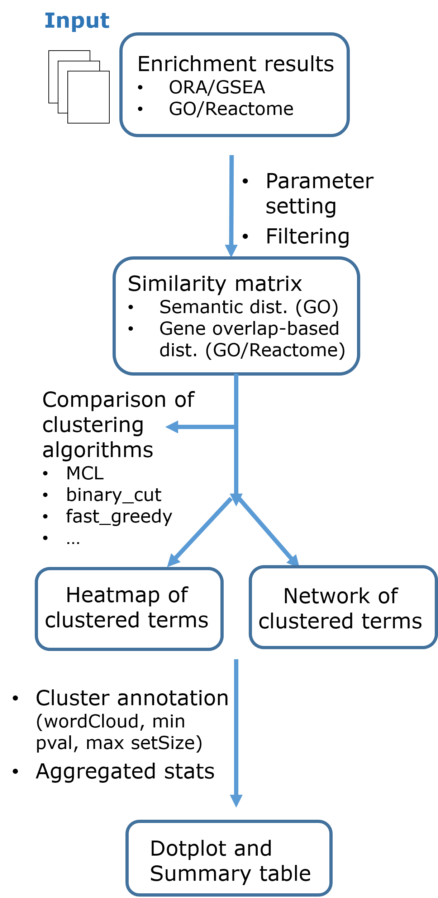

### RedRedundance

**RedRedundance** is an open-source interactive app developed in R-Shiny (https://shiny.rstudio.com/) that implements state-of-the-art tools such as simplifyEnrichment R package [1] and igraph/visNetwork [2,3] to facilitate the comparison and summarization of enrichment analysis results across different databases and gene lists. With this app, the user can easily explore and filter the results of gene set enrichment analyses, choose among different algorithms for clustering and annotating the individual gene sets into larger groups and aggregate their statistics into a more meaningful unit that brings meaning back to biological significance studies.

References:

[1] Gu Z and Hübschmann D (2022). Simplify enrichment: A bioconductor package for clustering and visualizing functional enrichment results. Genomics, proteomics & Bioinformatics.

[2] Gábor Csárdi and Tamás Nepusz (2006). The igraph software package for complex network research. InterJournal Complex Systems.

[3] Almende B.V., Benoit Thieurmel and Titouan Robert (2021). visNetwork: Network Visualization using 'vis.js' Library. CRAN R package. 

**Main features**

* Explore and filter the results of enrichment analyses

* Summarize and visually compare the results of enrichment analysis across multiple lists and databases (GO/Reactome). Many organisms supported.

* Choose and compare among different algorithms for clustering individual gene sets into larger groups

* Annotate and aggregate cluster statistics

* Display results in multiple visualization options (Heatmaps, Networks, Dotplots, Tabular format...)

**Workflow**

The following workflow summarizes the main steps performed with RedRedundance:

  

**Example data** 

Example data is provided in folder `data_example` and was generated using Mouse mammary gland dataset (GSE60450)[4]. Gene Set Enrichment Analysis (GSEA) over GO.BP and ReactomePA databases was performed on preranked gene lists of Basal.VirginVsLactate and Luminal.VirginVsLactate comparisons.

[4] Fu et al. (2015) EGF-mediated induction of Mcl-1 at the switch to lactation is essential for alveolar cell survival. Cell Biology.
References:

### Authors

**Mireia Ferrer Almirall, PhD** (auth, cre)

Statistics and Bioinformatics Unit (UEB), Vall d'Hebron Research Institute (VHIR), Barcelona, Spain

mireia.ferrer@vhir.org

**Àlex Sánchez Pla, PhD** (auth)

Statistics and Bioinformatics Unit (UEB), Vall d'Hebron Research Institute (VHIR).
Genetics Microbiology and Statistics Department, Universitat de Barcelona.
Biostatistics and Bioinformatics Research Group (GRBio).

alex.sanchez@vhir.org

### Code availability

The app can be freely accessed through the Web in:  https://mferrer-almirall.shinyapps.io/RedRedundance/

Or downloaded from Github in: https://github.com/mferrer-almirall/RedRedundance

### Usage

_This section is under development_

